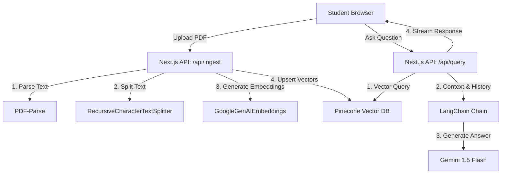

# Technical Build Plan: Engineering Exam & Study Tool

This document outlines the system architecture, database schema, data ingestion pipeline, RAG query pipeline, and step-by-step implementation plan to build the Engineering Exam & Study Tool in **2.5 to 3 weeks**.

## 1. System Architecture

The application is built on Next.js, using Pinecone as the vector database, Supabase for auth/relational data, LangChain for LLM orchestration, and Gemini 1.5 Flash for generation.



## 2. Ingestion Pipeline

When a student uploads a study guide or note PDF:

1. **Server Parsing:** Parse the file buffer to text using `pdf-parse` in a Next.js serverless route.
2. **Text Chunking:** Chunk the text using `RecursiveCharacterTextSplitter` (chunk size: 1000 characters, overlap: 200 characters) to preserve paragraph context.
3. **Embeddings:** Convert chunks into vectors using the `text-embedding-004` model from Gemini via LangChain.
4. **Pinecone Indexing:** Upsert vectors into a user-specific namespace (e.g., `user_${userId}`) inside a single starter Pinecone index to segregate documents.

## 3. RAG Query Pipeline (LangChain & Gemini)

To perform question-answering:

1. **Embedding Query:** Embed the student's question.
2. **Vector Retrieval:** Query Pinecone using the active user's namespace, retrieving the top 4–6 most similar chunks.
3. **Prompt Construction:** Format a system prompt to inject the relevant chunks as context:

   ```text
   You are an engineering academic tutor. Solve the user's question using ONLY the provided notes and context.
   If the answer requires math, show the step-by-step derivation.
   Use markdown tables to present structured comparisons where appropriate.
   If the context doesn't contain the answer, say "I cannot find this in your uploaded notes. However, based on general engineering principles..."
   
   Context:
   {retrieved_context}
   
   User Question:
   {user_question}
   ```

4. **Generation & Streaming:** Feed the prompt to Gemini 1.5 Flash and stream the text response back to the client.

## 4. Database Schema (Supabase)

To support files tracking and freemium query limits:

### Table: `user_study_stats`

- `user_id` (uuid, primary key, references auth.users.id)
- `tier` (text, default: 'free')
- `daily_queries_count` (int, default: 0)
- `total_uploaded_files` (int, default: 0)
- `last_reset_date` (timestamp with time zone, default: now())

### Table: `uploaded_documents`

- `id` (uuid, primary key)
- `user_id` (uuid, references auth.users.id)
- `file_name` (text)
- `file_size` (int) -- in bytes
- `pinecone_namespace` (text)
- `created_at` (timestamp with time zone, default: now())

## 5. Phase-by-Phase Implementation Roadmap

### Phase 1: Ingestion Setup (Days 1–5)

- Initialize Next.js project with Tailwind CSS or Vanilla CSS.
- Install LangChain packages: `@langchain/google-genai`, `@langchain/pinecone`, `pdf-parse`.
- Build the `/api/ingest` upload route. Test with a 10-page engineering PDF and verify vectors are visible in the Pinecone Starter dashboard.

### Phase 2: RAG Orchestration (Days 6–10)

- Build the `/api/query` streaming route using LangChain.
- Test LLM accuracy with engineering questions (e.g., "Explain how Quicksort works step-by-step").
- Add history support using LangChain's memory module to let students ask follow-up questions.

### Phase 3: Subject Seeding & Core UI (Days 11–14)

- Upload 2-3 common subject notes (e.g., Data Structures, Operating Systems) to a global namespace to serve as a pre-loaded "PYQ library" for new users.
- Design a clean, responsive layout:
  - Left panel: Uploaded PDF manager & subject list.
  - Center: Chat interface with clear formatting for mathematical notation (using a LaTeX renderer if needed) and tables.
  - Right panel: Instant Quiz and Flashcard generators extracted from selected documents.

### Phase 4: Gating & Subscriptions (Days 15–18)

- Implement query count checks on `/api/query` and upload limits on `/api/ingest`.
- Integrate Razorpay checkout for unlimited tier upgrades.

### Phase 5: Verification & Launch (Days 19–21)

- Verify accuracy under slow network conditions.
- Test PDF upload chunking limits.
- Deploy to Vercel and distribute pilot links to student testing networks.
