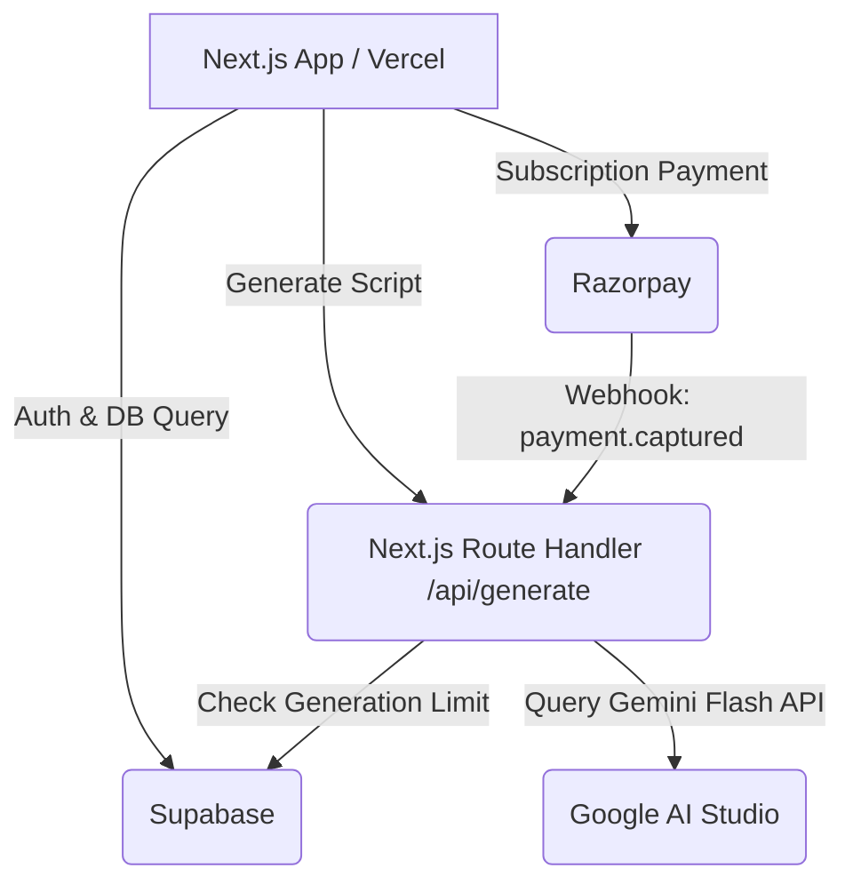

# Technical Build Plan: Reels Script Generator

This document outlines the system architecture, database schema, prompt engineering guidelines, and step-by-step implementation plan to build the Reels Script Generator in **1.5 to 2 weeks**.

## 1. System Architecture
The application runs on a Next.js framework deployed to Vercel, integrating Supabase for auth/data and Gemini for AI generations.



## 2. Database Schema (Supabase)
To support usage limits, authentication, and history tracking, we need two tables:

### Table: `profiles`
Tracks user details, usage quotas, and subscription tier.
- `id` (uuid, primary key, references auth.users.id)
- `email` (text)
- `tier` (text, default: 'free') -- 'free' or 'pro'
- `daily_generations_count` (int, default: 0)
- `last_reset_date` (timestamp with time zone, default: now())

### Table: `scripts`
Stores history of user generations.
- `id` (uuid, primary key, default: uuid_generate_v4())
- `user_id` (uuid, references auth.users.id)
- `niche` (text)
- `tone` (text)
- `duration` (int) -- in seconds
- `language` (text)
- `hook` (text)
- `script_body` (text)
- `visual_cues` (text)
- `caption` (text)
- `hashtags` (text[])
- `created_at` (timestamp with time zone, default: now())

## 3. Gemini 1.5 Flash System Prompt
To guarantee structured JSON output from Gemini Flash, use the `responseSchema` configuration parameter in the Gemini SDK or enforce it with the system prompt:

```text
You are an expert social media copywriter and growth engineer. Your task is to output a high-impact, virally optimized vertical video script based on the user's inputs: niche, tone, duration, and language.

Your response MUST be a valid JSON object matching the following structure:
{
  "hook": "An attention-grabbing first 3 seconds statement (using pattern interrupt or curiosity gaps)",
  "script_body": "The script text paced perfectly for the requested duration. Write in a conversational tone. Include pauses.",
  "visual_cues": "Step-by-step instructions on what visual actions, text overlays, or b-roll to show corresponding to the audio",
  "caption": "A compelling, high-conversion caption optimized for comments and shares",
  "hashtags": ["list", "of", "5-7", "relevant", "trending", "hashtags"]
}
```

## 4. Gating Middleware & Razorpay Integration
- **Limit Checker:** A Next.js API Middleware or Route Handler check that runs before forwarding requests to Gemini:
  1. Retrieve user profile by auth ID.
  2. If `now() - last_reset_date > 24 hours`, reset `daily_generations_count = 0` and update `last_reset_date = now()`.
  3. If user is `free` and `daily_generations_count >= 5`, reject with a `403 Upgrade Required` response.
  4. Otherwise, proceed with generation and increment `daily_generations_count` by 1.
- **Payment Webhook:** Create `/api/webhook/razorpay` to listen for `subscription.charged` or `payment.captured` webhooks from Razorpay to update the user's profile `tier = 'pro'`.

## 5. Phase-by-Phase Implementation Roadmap

### Phase 1: Initial Setup & Database (Days 1–3)
- Create a Next.js workspace using `npx create-next-app@latest`.
- Initialize Supabase project and apply the SQL schema for `profiles` and `scripts`.
- Enable Supabase Email/Password or Google Auth.

### Phase 2: Core AI Integration (Days 4–6)
- Setup route `/api/generate` connecting to the `@google/generative-ai` SDK.
- Configure system prompt and parse the output JSON.
- Implement the limit-checking middleware.

### Phase 3: Frontend UI Development (Days 7–9)
- Design a modern glassmorphic dashboard interface.
- Add an input form containing:
  - Input field for Niche (e.g., Tech, Fitness, Finance).
  - Selector for Tone (e.g., Energetic, Informative, Humorous).
  - Slider for Duration (e.g., 15s, 30s, 60s).
- Display a split panel: Form on left, beautifully rendered script output card on the right (with copy-to-clipboard buttons for hook, script, and captions).

### Phase 4: Billing & Subscriptions (Days 10–12)
- Register a Razorpay Sandbox account.
- Add "Upgrade to Pro" button in the dashboard, opening Razorpay Checkout.
- Implement the webhook endpoint in Next.js to handle success/failure states.

### Phase 5: Testing & Deployment (Days 13–15)
- Deploy to Vercel.
- Configure environment variables (`DATABASE_URL`, `GEMINI_API_KEY`, `RAZORPAY_KEY_ID`, etc.).
- Validate sandbox payment checkout flows and API rate-limiting handling.
